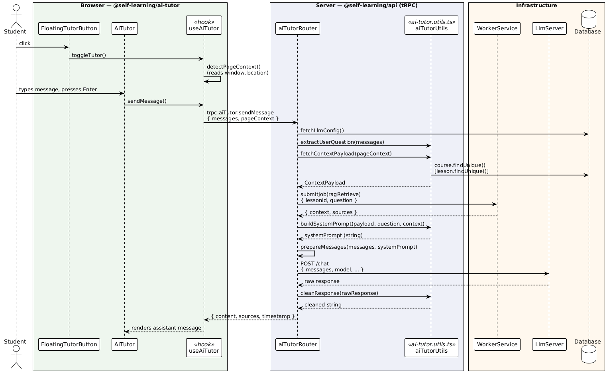

# `@self-learning/ai-tutor`

**Library path:** `libs/feature/ai-tutor`

A React feature library that provides the AI Tutor chat panel, its UI components, state management hook, and server-side utility functions consumed by the tRPC router.

---

## Overview

The AI Tutor is a context-aware chat assistant that students can open while browsing a course or lesson page. It detects the current page context (course or lesson), retrieves relevant lesson content via RAG, and sends the conversation to a configured LLM server through a tRPC mutation — all server-side.

The library is split into two clear layers:

| Layer                  | Location                        | Runs on              |
| ---------------------- | ------------------------------- | -------------------- |
| UI (components + hook) | `lib/components/`, `lib/hooks/` | Client (browser)     |
| Router utilities       | `lib/utils/ai-tutor.utils.ts`   | Server (tRPC router) |

---

## Architecture

The diagram below shows the full flow from user interaction to LLM response.



---

## Directory Structure

```
libs/feature/ai-tutor/src/
├── index.ts                          # Public exports of the library
└── lib/
    ├── components/
    │   ├── ai-tutor.tsx              # Main slide-in chat panel
    │   ├── ai-tutor-header.tsx       # Panel header (title, clear, close)
    │   ├── ai-tutor-messages.tsx     # Message list with markdown rendering
    │   ├── ai-tutor-input.tsx        # Textarea + send button
    │   └── floating-tutor-button.tsx # Fixed-position trigger button
    ├── hooks/
    │   └── use-ai-tutor.tsx          # All UI state and tRPC mutation logic
    └── utils/
        └── ai-tutor.utils.ts         # Server-side helpers for ai-tutor.router.ts
```

---

## How It Works — Request Pipeline

When a student sends a message, the router executes these steps in order:

1. **Fetch LLM config** — reads `serverUrl`, `apiKey`, `defaultModel` from the database.
2. **Extract user question** — finds the last `role: "user"` message in the thread (`extractUserQuestion`).
3. **Fetch page context** — resolves course/lesson metadata from the database based on the URL context sent by the client (`fetchContextPayload`).
4. **RAG retrieval** — submits a `ragRetrieve` job to the Worker Service and awaits the result (`context` string + `sources` array). Only runs for lesson pages.
5. **Build system prompt** — composes the final system prompt from the base prompt, context payload, and RAG content (`buildSystemPrompt`).
6. **Prepare messages** — injects or replaces the system message in the conversation history.
7. **Send to LLM** — HTTP POST to the configured LLM server. Runs server-side only. API key never reaches the client.
8. **Clean response** — strips `<think>...</think>` blocks from reasoning models (`cleanResponse`).
9. **Validate sources** — filters source types to the allowed union `"pdf" | "article" | "video"`.

---

## Usage

### Rendering the tutor on a page

The `useAiTutor` hook manages all state. Pass it down to both components:

```tsx
import { useAiTutor, AiTutor, FloatingTutorButton } from "@self-learning/ai-tutor";

export default function CoursePage() {
	const tutorState = useAiTutor();

	return (
		<>
			{/* page content */}
			<FloatingTutorButton onToggle={tutorState.toggleTutor} disabled={!tutorState.config} />
			<AiTutor tutorState={tutorState} />
		</>
	);
}
```

The tutor is only rendered when a valid `LlmConfiguration` exists in the database (`config` is `undefined` otherwise, and `AiTutor` returns `null`).

### Page context detection

`useAiTutor` automatically detects the page context when the tutor is opened by reading `window.location.pathname`. The expected URL shapes are:

| URL pattern                        | Detected context                             |
| ---------------------------------- | -------------------------------------------- |
| `/courses/:courseSlug`             | `{ type: "course", courseSlug }`             |
| `/courses/:courseSlug/:lessonSlug` | `{ type: "lesson", courseSlug, lessonSlug }` |
| `/lessons/:lessonSlug`             | `{ type: "lesson", lessonSlug }`             |
| Anything else                      | `null` (no context, default prompt used)     |

---

## Extending the Library

### Adding a new prompt strategy

1. Add a new branch in `buildSystemPrompt` in `ai-tutor.utils.ts`.
2. Extend the `ContextPayload` type in `@self-learning/types` if a new context shape is needed.
3. Add a corresponding `fetchContextPayload` branch to resolve the new context from the database.
4. Add test cases to `ai-tutor.utils.spec.ts`.

### Adding a new UI component

1. Create the component under `lib/components/`.
2. Wire it through `AiTutor` or directly to `useAiTutor` state.
3. Export it from `index.ts` if it needs to be used on page level.

### Changing the LLM server

The LLM server URL, API key, and default model are read from the `LlmConfiguration` table at runtime. No code change is required — update the database record via the admin interface.

---

## Important Constraints

**LLM API key must stay server-side.** The `sendChatRequest` logic lives in `ai-tutor.router.ts` (not in this library) for this reason. Do not move LLM communication into `ai-tutor.utils.ts` or any client-side module — it would expose the API key in the browser bundle.

**No session state.** The conversation history is held in React state (`useAiTutor`) for the duration of the browser session only. There is no persistence layer. Each `sendMessage` call passes the full message history to the router.

**RAG is lesson-only.** The Worker Service retrieval job is only submitted when the page context resolves to `type: "lesson"`. Course-level and context-less prompts do not include RAG content.
