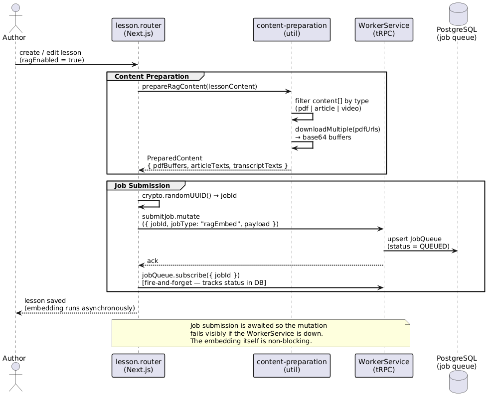
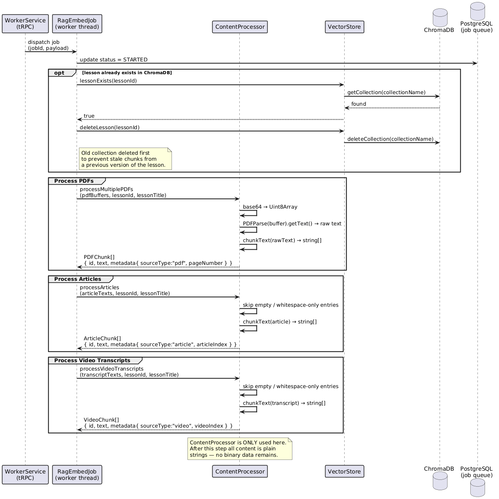
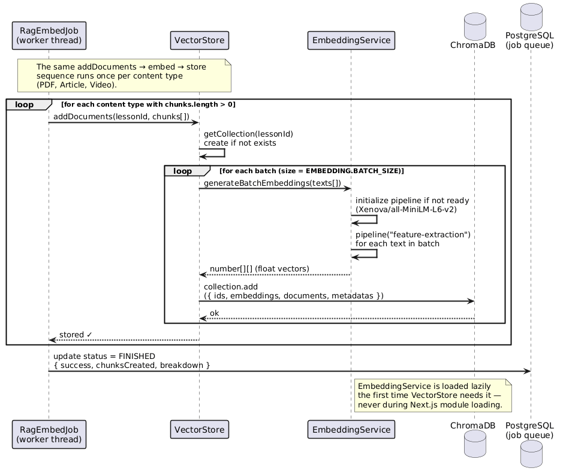
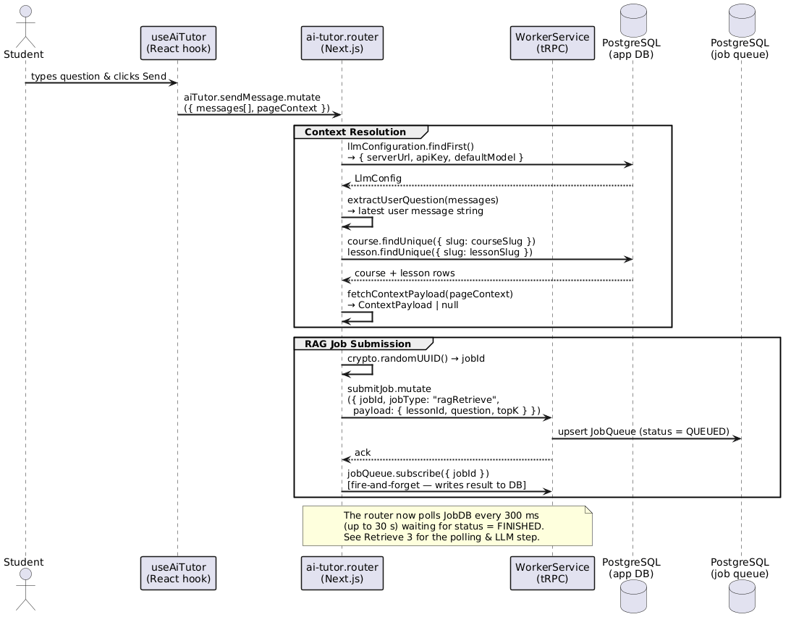
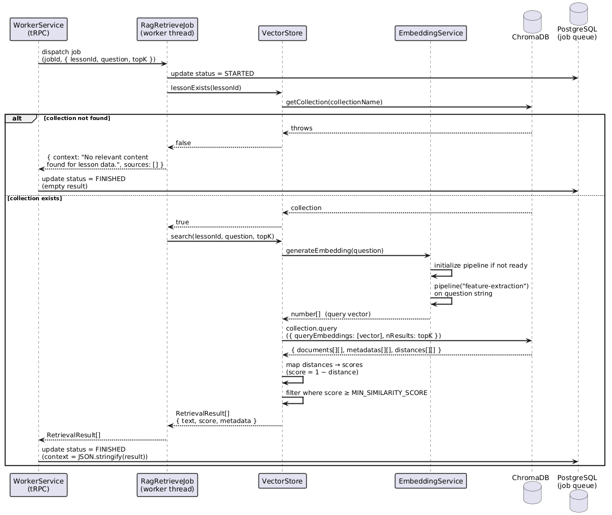
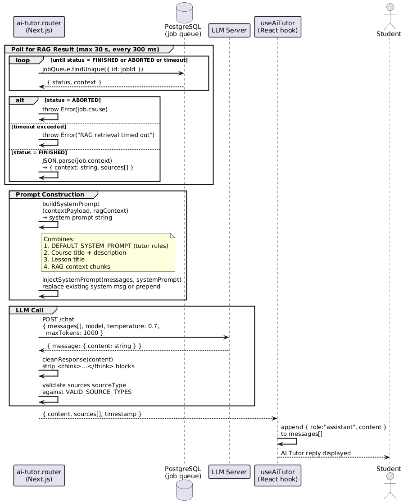

# RAG Processing Library

A library that provides Retrieval-Augmented Generation (RAG) capabilities for the self-learn platform. It handles content ingestion (PDF extraction, chunking, embedding) and semantic retrieval used to supply relevant lesson context to the AI Tutor.

---

## Architecture Overview

The library is composed of three main services and a set of utilities. Each service has a clearly scoped responsibility:

**ContentProcessor** converts raw binary or text lesson content into plain text chunks. It is only invoked inside the `RagEmbedJob` worker and is not used during retrieval.

**EmbeddingService** wraps the `@xenova/transformers` pipeline to turn text strings into numerical vectors. It is called both during ingestion (to embed chunks before storing them) and during retrieval (to embed the user's query before searching).

**VectorStore** manages the ChromaDB collections. It delegates all text-to-vector conversion to `EmbeddingService` and then either writes the resulting vectors to ChromaDB (ingestion) or queries ChromaDB with them (retrieval).

---

## Component Interaction

### Ingestion Path (triggered by `RagEmbedJob`)

When a lesson is created or updated with `ragEnabled = true` (by default ragEnabled is true), the `lesson.router` enqueues a `ragEmbed` job in the worker service. Inside the worker:

1. `ContentProcessor.processMultiplePDFs` / `processArticles` / `processVideoTranscripts` parse raw content into `DocumentChunk[]`.
2. `VectorStore.addDocuments` receives those chunks, calls `EmbeddingService.generateBatchEmbeddings` to produce vectors, and stores the id/text/embedding/metadata tuples in a per-lesson ChromaDB collection.

### Retrieval Path (triggered by `RagRetrieveJob` / AI Tutor)

When the AI Tutor sends a user question, the `ai-tutor.router` enqueues a `ragRetrieve` job. Inside the worker:

1. `VectorStore.search` calls `EmbeddingService.generateEmbedding` on the query text to obtain a query vector.
2. It then runs `collection.query` against ChromaDB and returns ranked `RetrievalResult[]`.
3. The results are serialised and written back to the job queue record, where the router polls for them and injects them as context into the system prompt.

> **Note:** `ContentProcessor` is **not** involved in retrieval. After the ingestion job, all further interactions with the vector store operate on strings only.

---

## Sequence Diagrams

All diagrams can be rendered at [https://editor.plantuml.com/](https://editor.plantuml.com/).

The full flow is split into **6 focused diagrams** — 3 for embedding (ingestion) and 3 for retrieval — so each one stays readable on its own.

---

## Embed Flow

> Triggered whenever a lesson is created or updated with `ragEnabled = true`.

```
Embed 1 → Content Preparation & Job Submission   (Next.js process)
Embed 2 → Worker: Content Chunking               (ContentProcessor inside worker thread)
Embed 3 → Worker: Embedding & Storage            (VectorStore → EmbeddingService → ChromaDB)
```

---

### Embed 1 — Content Preparation & Job Submission

The author saves a lesson. Next.js downloads all PDF files, extracts article text, then submits a `ragEmbed` job to the WorkerService and subscribes to its events for status tracking.



---

### Embed 2 — Worker: Content Chunking

The WorkerService dispatches the job to a free worker thread. `RagEmbedJob` checks whether stale embeddings exist, then delegates each content type to `ContentProcessor` which parses and chunks the raw content into typed `DocumentChunk` arrays.



---

### Embed 3 — Worker: Embedding & Storage

For each content type, `RagEmbedJob` hands the chunks to `VectorStore`, which generates float-vector embeddings via `EmbeddingService` and writes them to ChromaDB. The job then reports its final status.



---

## Retrieval Flow

> Triggered whenever a student sends a message through the AI Tutor panel.

```
Retrieve 1 → Message dispatch & context resolution   (browser → Next.js → DB)
Retrieve 2 → Vector search                           (VectorStore → EmbeddingService → ChromaDB)
Retrieve 3 → Result polling & LLM call               (Next.js polls DB → builds prompt → calls LLM)
```

---

### Retrieve 1 — Message Dispatch & Context Resolution

The student's message travels from the React hook to the tRPC router. The router resolves the LLM config, the user's question, and the course/lesson context from the database, then submits a `ragRetrieve` job.



---

### Retrieve 2 — Vector Search

Inside the worker thread, `RagRetrieveJob` checks for the lesson collection, then delegates the full vector search to `VectorStore`: the user's question is embedded, ChromaDB is queried, and results are filtered by minimum similarity score.



---

### Retrieve 3 — Result Polling & LLM Call

Back in Next.js, the router polls the job queue until the result is ready, builds the system prompt by injecting RAG context and course/lesson info, calls the LLM, and returns the cleaned response to the React hook.



---

## Service Responsibilities

### ContentProcessor

- **Used by:** `RagEmbedJob` (worker thread only)
- **Responsibility:** Converts raw content into `DocumentChunk[]` ready for embedding.
    - Extracts text from PDF binary buffers via `pdf-parse`.
    - Splits articles and video transcripts into overlapping chunks via `chunking` util.
    - Attaches typed metadata (`sourceType`, `pageNumber`, `articleIndex`, `videoIndex`).
- **Not involved in retrieval.**

### EmbeddingService

- **Used by:** `VectorStore` (both ingestion and retrieval paths)
- **Responsibility:** Generates float-vector embeddings from text strings using the `Xenova/all-MiniLM-L6-v2` model loaded through `@xenova/transformers`.
    - `generateBatchEmbeddings` — used during ingestion to embed many chunks efficiently.
    - `generateEmbedding` — used during retrieval to embed a single user query.
- The service is loaded lazily inside `VectorStore.getEmbeddingService()` so that the heavy transformer model is never parsed in the Next.js server process.

### VectorStore

- **Used by:** `RagEmbedJob` (ingestion) and `RagRetrieveJob` (retrieval)
- **Responsibility:** Manages per-lesson ChromaDB collections.
    - **Ingestion:** `addDocuments(lessonId, chunks)` — calls `EmbeddingService.generateBatchEmbeddings`, then writes to ChromaDB via `collection.add`.
    - **Retrieval:** `search(lessonId, query, topK)` — calls `EmbeddingService.generateEmbedding`, then queries ChromaDB via `collection.query` and returns `RetrievalResult[]` filtered by a minimum similarity score.
    - Implements a simple circuit breaker to stop hammering ChromaDB after repeated failures.

---

## Configuration

All tuneable parameters live in `src/lib/config/rag-config.ts` under the `RAG_CONFIG` constant:

| Section        | Key                    | Default                   | Description                                             |
| -------------- | ---------------------- | ------------------------- | ------------------------------------------------------- |
| `EMBEDDING`    | `MODEL_NAME`           | `Xenova/all-MiniLM-L6-v2` | HuggingFace model identifier                            |
| `EMBEDDING`    | `BATCH_SIZE`           | `10`                      | Chunks processed per embedding call                     |
| `VECTOR_STORE` | `HOST` / `PORT`        | `localhost:8000`          | ChromaDB connection (env: `CHROMA_HOST`, `CHROMA_PORT`) |
| `VECTOR_STORE` | `COLLECTION_PREFIX`    | `lesson_`                 | Prefix prepended to every collection name               |
| `VECTOR_STORE` | `MAX_FAILURES`         | `3`                       | Circuit breaker threshold                               |
| `RETRIEVAL`    | `MIN_SIMILARITY_SCORE` | `0.3`                     | Cosine similarity cut-off for search results            |
| `CHUNKING`     | `DEFAULT_SIZE`         | `1000`                    | Maximum characters per chunk                            |
| `CHUNKING`     | `DEFAULT_OVERLAP`      | `200`                     | Overlap characters between adjacent chunks              |
| `DOWNLOAD`     | `MAX_FILE_SIZE_MB`     | `50`                      | Maximum PDF size accepted                               |
